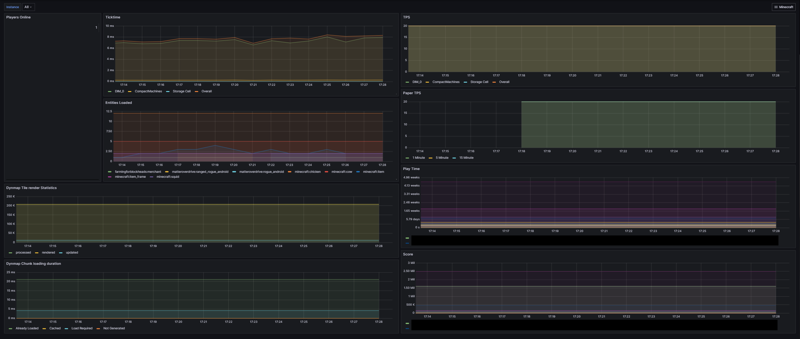
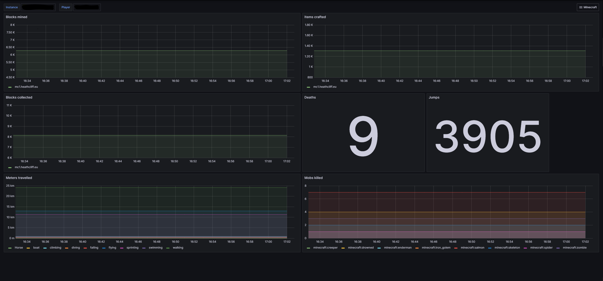

[](https://github.com/heathcliff26/minecraft-exporter/actions/workflows/ci.yaml)
[](https://coveralls.io/github/heathcliff26/minecraft-exporter)
[](https://github.com/heathcliff26/minecraft-exporter/actions/workflows/editorconfig-check.yaml)
[](https://github.com/heathcliff26/minecraft-exporter/actions/workflows/go-testcover-report.yaml)
[](https://github.com/heathcliff26/minecraft-exporter/actions/workflows/renovate.yaml)

# minecraft-exporter

This is a prometheus exporter for minecraft stats.
It collects metrics from the save folder, as well as over RCON.
This includes advancements, player stats, Tick stats and dynmap stats.
The exporter is implemented purely in golang for a small image and memory footprint.

Before i created this exporter, i used the one from [Joshi425](https://github.com/Joshi425/minecraft-exporter), which is why the dashboard looks nearly identical.
However it seems the other exporter is abandoned, so i wrote my own.
There is zero compatibility to the other exporter.

## Table of Contents

- [minecraft-exporter](#minecraft-exporter)
  - [Table of Contents](#table-of-contents)
  - [Container Images](#container-images)
    - [Image location](#image-location)
    - [Tags](#tags)
  - [Usage](#usage)
    - [Kubernetes](#kubernetes)
  - [Metrics](#metrics)
    - [Reduced Metrics](#reduced-metrics)
    - [RCON Metrics](#rcon-metrics)
      - [Since minecraft version 1.20.3](#since-minecraft-version-1203)
    - [(Neo)Forge Metrics](#neoforge-metrics)
    - [Paper Metrics](#paper-metrics)
    - [Dynmap Metrics](#dynmap-metrics)
  - [Dashboard](#dashboard)
    - [Minecraft - Server](#minecraft---server)
    - [Minecraft - Player](#minecraft---player)

## Container Images

### Image location

| Container Registry                                                                                      | Image                                       |
| ------------------------------------------------------------------------------------------------------- | ------------------------------------------- |
| [Github Container](https://github.com/users/heathcliff26/packages/container/package/minecraft-exporter) | `ghcr.io/heathcliff26/minecraft-exporter`   |
| [Docker Hub](https://hub.docker.com/r/heathcliff26/minecraft-exporter)                                  | `docker.io/heathcliff26/minecraft-exporter` |

### Tags

There are different flavors of the image:

| Tag(s)      | Description                                                 |
| ----------- | ----------------------------------------------------------- |
| **latest**  | Last released version of the image                          |
| **rolling** | Rolling update of the image, always build from main branch. |
| **vX.Y.Z**  | Released version of the image                               |

## Usage

Output of `minecraft-exporter -h`
```
Usage of minecraft-exporter:
  -config string
        Optional: Path to config file
  -env
        Used together with -config, when set will expand enviroment variables in config
  -version
        Show the version information and exit
```
An example configuration can be found [here](configs/example-config.yaml).

The container can be run with:
```
podman run -d -p 8080:8080 -v /path/to/world:/world:ro ghcr.io/heathcliff26/minecraft-exporter:latest
```
Metrics will be available under `http://localhost:8080/metrics`.

Running the container with config file:
```
podman run -d -p 8080:8080 -v /path/to/world:/world:ro -v /path/to/config.yaml:/config/config.yaml ghcr.io/heathcliff26/minecraft-exporter:latest -config /config/config.yaml
```

### Kubernetes

Helm charts are released via oci repos and can be installed with:
```
helm install minecraft-exporter oci://ghcr.io/heathcliff26/manifests/minecraft-exporter --version <version>
```
Please use the latest version from the releases page.

## Metrics

The following metrics are generated from the save and will always be exported:

| Metric                               | Description                                                                |
| ------------------------------------ | -------------------------------------------------------------------------- |
| `minecraft_stat_blocks_mined`        | Blocks a player mined                                                      |
| `minecraft_stat_blocks_picked_up`    | Blocks a player picked up                                                  |
| `minecraft_stat_blocks_crafted`      | Items a player crafted                                                     |
| `minecraft_stat_deaths`              | How often a player died. Cause `minecraft:deaths` is used for total deaths |
| `minecraft_stat_jumps`               | How often a player has jumped                                              |
| `minecraft_stat_cm_traveled`         | How many cm a player traveled                                              |
| `minecraft_stat_xp_total`            | How much total XP a player earned                                          |
| `minecraft_stat_current_level`       | How many levels the player currently has                                   |
| `minecraft_stat_food_level`          | How fed the player currently is                                            |
| `minecraft_stat_health`              | How much health the player currently has                                   |
| `minecraft_stat_score`               | The score of the player                                                    |
| `minecraft_stat_entities_killed`     | Entities killed by player                                                  |
| `minecraft_stat_damage_taken`        | Damage taken by player                                                     |
| `minecraft_stat_damage_dealt`        | Damage dealt by player                                                     |
| `minecraft_stat_playtime`            | Time in minutes a player was online                                        |
| `minecraft_stat_advancements`        | Number of completed advancements of a player                               |
| `minecraft_stat_slept`               | Times a player slept in a bed                                              |
| `minecraft_stat_used_crafting_table` | Times a player used a crafting table                                       |
| `minecraft_stat_custom`              | Custom minecraft stat                                                      |

### Reduced Metrics

In order to save metrics usage, the option to reduce the metrics series that will be exposed can be enabled in the configuration.

If the option is enabled, all `minecraft_stat_blocks_*` metrics will only contain the total per player, instead of per block. This results in significantly less metrics, as there won't be a series per player per block.

### RCON Metrics

The following metrics will be exposed when RCON is enabled:

| Metric                    | Description                                      |
| ------------------------- | ------------------------------------------------ |
| `minecraft_player_online` | Show currently online players. Value is always 1 |

#### Since minecraft version 1.20.3

| Metric                      | Description                           |
| --------------------------- | ------------------------------------- |
| `minecraft_tick_target`     | Targeted number of ticks per second   |
| `minecraft_tick_average`    | Average time per tick in milliseconds |
| `minecraft_tick_percentile` | Time per tick in percentiles          |


### (Neo)Forge Metrics

These metrics will be exposed when the server is forge or neoforge:

| Metric                   | Description                      |
| ------------------------ | -------------------------------- |
| `forge_tps_dim`          | TPS of a dimension               |
| `forge_ticktime_dim`     | Time a Tick took in a Dimension  |
| `forge_tps_overall`      | Overall TPS                      |
| `forge_ticktime_overall` | Overall Ticktime                 |
| `forge_entity_count`     | Type and count of active entites |

### Paper Metrics

These metrics will be exposed when the server is paper:

| Metric          | Description   |
| --------------- | ------------- |
| `paper_tps_1m`  | 1 Minute TPS  |
| `paper_tps_5m`  | 5 Minute TPS  |
| `paper_tps_15m` | 15 Minute TPS |

### Dynmap Metrics

These metrics will be exposed when dynmap is enabled:

| Metric                          | Description                                 |
| ------------------------------- | ------------------------------------------- |
| `dynmap_tile_render_stat`       | Tile Render Statistics reported by Dynmap   |
| `dynmap_chunk_loading_count`    | Chunk Loading Statistics reported by Dynmap |
| `dynmap_chunk_loading_duration` | Chunk Loading Statistics reported by Dynmap |

## Dashboard

There are 2 different dashboards, one for stats for the server and one for stats for players.

### Minecraft - Server

The dashboard can be imported from [json](dashboard/server.json) or from grafana.com with the id [24440](https://grafana.com/grafana/dashboards/24440-minecraft-server/).

Here is a preview:


### Minecraft - Player

The dashboard can be imported from [json](dashboard/player.json) or from grafana.com with the id [24441](https://grafana.com/grafana/dashboards/24441-minecraft-player/).

Here is a preview:

